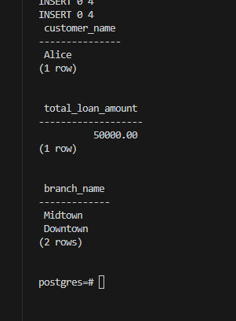
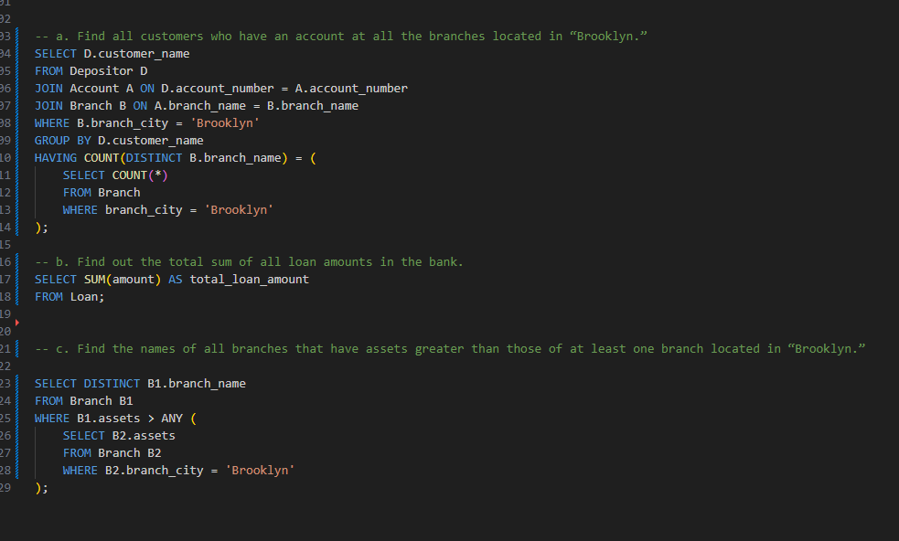

# DSC_E3.15

Consider the bank database of Figure 3.19, where the primary keys are underlined. Construct the following SQL queries for this relational database:

a. Find all customers who have an account at all the branches located in “Brooklyn.”

b. Find out the total sum of all loan amounts in the bank.

c. Find the names of all branches that have assets greater than those of at least one branch located in “Brooklyn.”

